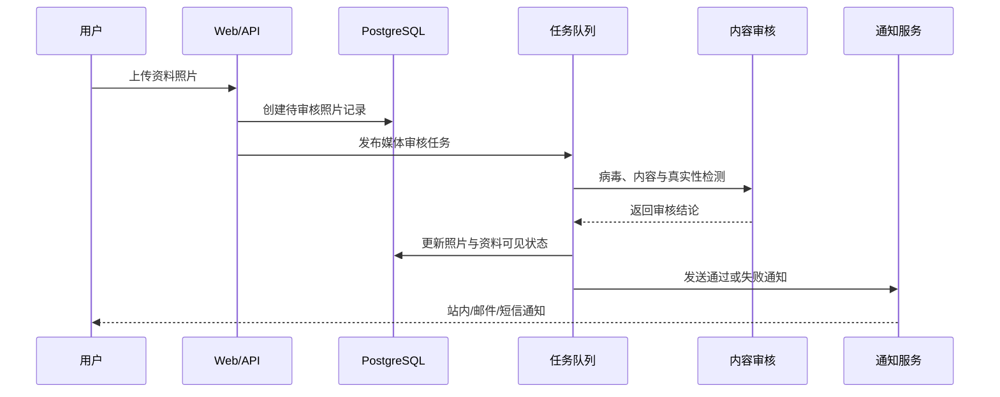
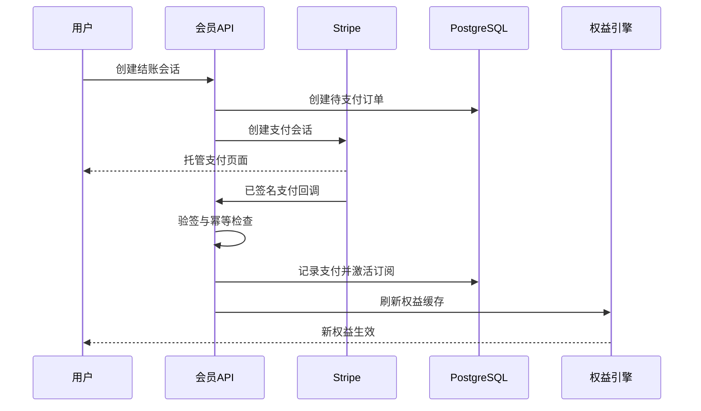

# 全球交友平台开发规格（功能对标 ChinaLoveCupid）

- 文档状态：已确认，可进入实施计划阶段
- 确认日期：2026-08-05
- 首发形态：响应式 Web + 运营管理后台
- 目标市场：全球用户，不限定性别、性取向或地区
- 商业策略：首发核心功能免费开放，后台可随时启用会员权限与付费限制

## 1. CAPABILITY（产品能力）

平台为全球成年用户提供从注册、认证、建立资料、发现潜在对象、表达兴趣、匹配、实时沟通，到举报和账号治理的完整交友闭环。运营团队可以在不改代码的情况下配置认证要求、功能开关、免费额度、会员套餐、国家价格、内容审核与风险策略；平台首发具备真实订阅、支付、续费和退款能力，同时为未来 iOS/Android App 提供稳定 API。

## 2. 参考产品与原创边界

### 2.1 公开能力参考

参考站公开页面展示了“创建资料—浏览会员—开始沟通”的主流程，以及资料浏览、喜欢、消息和高级搜索等能力；其公开条款还描述了分级会员、高级匹配、消息翻译、搜索曝光、消息优先级和付费订阅生命周期。本项目吸收的是产品能力与通用交互模式，而非复制其代码、商标、会员资料、摄影素材或受版权保护的文案。

参考资料：

- [ChinaLoveCupid 首页与三步主流程](https://www.chinalovecupid.com/)
- [ChinaLoveCupid About 页面公开会员能力](https://www.chinalovecupid.com/en/general/about)
- [ChinaLoveCupid 条款中的会员、支付、安全与身份验证说明](https://www.chinalovecupid.com/en/general/termsofuse)

### 2.2 必须原创

- 使用独立品牌名、域名、Logo、色彩、排版和营销文案。
- 不抓取或导入参考站用户、头像、评价、内容或数据库。
- 不复制参考站前端代码、接口、付费墙实现或内部匹配算法。
- 功能命名、套餐结构和页面布局以本项目需求重新设计。

## 3. CONSTRAINTS（约束、规则与边界）

### 3.1 固定产品规则

1. 仅允许年满 18 周岁的用户注册和使用。
2. 全球用户均可加入，性别和寻找对象采用可扩展枚举，不做男女二元硬编码。
3. 邮箱、手机号、真人认证和证件认证均由后台策略决定是否必需。
4. 首发核心功能默认免费，但每项权益必须经过统一权益引擎判断，不能在页面中硬编码免费。
5. 用户可以随时屏蔽和举报其他用户；屏蔽立即阻断双方发现、资料查看和消息互动。
6. 支付结果只以服务端已验证的支付回调为准，客户端成功页面不发放权益。
7. 订阅、认证、审核、封禁、退款和管理员操作必须留下不可篡改的审计记录。
8. 精确位置、证件资料、风控信号和内部审核备注不得出现在公开资料接口。
9. 用户请求注销后进入可配置冷静期；期满按法律、支付和安全保留要求删除或匿名化数据。
10. 所有外部服务通过适配器接入，支付、短信、认证和内容审核供应商可替换。

### 3.2 技术约束

- 架构：模块化单体为主，实时消息与异步任务保留独立运行边界。
- 前端与 API：Next.js + TypeScript，响应式设计，API 供 Web、后台和未来 App 共用。
- 主数据库：PostgreSQL；缓存、限流和短期状态：Redis。
- 文件：兼容 S3 的对象存储，通过签名上传；上传后必须经过格式校验、病毒与内容检查。
- 实时消息：WebSocket；断线恢复基于消息游标，不依赖客户端本地状态作为事实来源。
- 异步处理：任务队列负责邮件、短信、推送、图片处理、内容审核、搜索索引和对账。
- 支付：首期 Stripe；保留 Apple/Google 内购和地区支付渠道的适配器接口。
- 国际化：首发简体中文与英文，文案使用翻译键；日期、时区、货币和数字按地区格式化。

### 3.3 信任边界与数据所有权

| 数据 | 权威来源 | 公开性 | 关键规则 |
|---|---|---|---|
| 账户和资料 | PostgreSQL | 部分公开 | 公开接口只返回经过隐私策略过滤的字段 |
| 密码 | 认证模块 | 绝不公开 | 只保存 Argon2id 等强哈希，不可逆 |
| 支付卡信息 | 支付服务商 | 平台不可见 | 平台仅保存客户、订单、回调和付款状态标识 |
| 原始证件 | 认证服务商优先 | 平台不可见 | 平台保存认证结论、等级、时间和供应商引用 |
| 聊天内容 | 消息模块 | 会话成员可见 | 后台仅按权限、举报或法定流程访问 |
| 风控与审核 | 治理模块 | 内部可见 | 与公开资料隔离，访问和导出均审计 |
| 分析事件 | 分析系统 | 内部聚合 | 不把敏感内容直接写入分析载荷 |

## 4. IMPLEMENTATION CONTRACT（实施契约）

### 4.1 角色

| 角色 | 核心权限 |
|---|---|
| 游客 | 浏览营销页、注册、登录、查看法律与安全内容 |
| 普通会员 | 管理资料、发现用户、互动、聊天、举报、隐私和账号设置 |
| 已认证会员 | 展示认证标识；依据后台策略获得额外曝光或功能 |
| 付费会员 | 按套餐获得服务端计算的会员权益 |
| 内容审核员 | 处理资料、照片、消息举报和申诉，不可修改计费配置 |
| 客服人员 | 查看账号与订单摘要、处理支持工单和授权范围内的退款 |
| 运营人员 | 配置功能开关、权益、套餐、价格、活动、通知和内容规则 |
| 财务人员 | 查看订单、付款、退款、拒付和对账，不可阅读私人消息 |
| 超级管理员 | 管理后台角色和高风险配置；强制双重验证与操作审计 |

### 4.2 用户端页面与功能

#### P0：首发必须完成

1. **官网与获客**
   - 首页、功能介绍、安全中心、会员说明、帮助中心、法律页面。
   - SEO 落地页使用原创文案和受授权素材。
   - 注册入口、登录入口、语言选择和 Cookie/隐私同意。

2. **注册、登录与账号安全**
   - 邮箱注册、邮箱验证、手机号绑定与一次性验证码。
   - 密码登录、忘记密码、设备会话列表、退出其他设备。
   - 可选社交登录作为后续配置项，不作为首发硬依赖。
   - 年龄确认、条款与隐私版本同意记录。
   - 登录、注册、验证码、密码重置均执行限流和异常检测。

3. **新用户引导与资料**
   - 基本信息、性别、寻找对象、出生日期、国家/城市、语言。
   - 头像与多张照片、个人简介、兴趣、职业、教育、关系目标、生活方式。
   - 择偶偏好：年龄、距离/地区、性别、语言、关系目标、生活方式等。
   - 资料完整度、公开预览、字段级隐私设置和照片排序。
   - 照片进入自动/人工审核流程；违规内容不可公开。

4. **认证中心**
   - 邮箱状态、手机状态、真人状态和证件状态分开展示。
   - 后台按国家、风险级别或功能配置认证门槛。
   - 认证失败可重试；过期可重新认证；用户可查看清晰原因和下一步。

5. **发现、搜索与推荐**
   - 推荐流、新用户、附近、在线、已认证等入口。
   - 基础筛选：年龄、性别、地区、语言、关系目标。
   - 高级筛选：资料属性、生活方式、兴趣、认证状态、最近活跃。
   - 排序：相关度、最近活跃、新加入、距离；运营可配置默认排序。
   - 用户可以保存搜索条件；精确经纬度永不向其他会员返回。
   - 推荐排序首版采用可解释规则分，不使用黑箱 AI 作为唯一决策。

6. **资料详情与互动**
   - 查看公开资料、照片、认证标识、资料完整度和最近活跃的模糊状态。
   - 喜欢、取消喜欢、收藏、取消收藏、发送兴趣、发起聊天。
   - 双向喜欢形成匹配；匹配事件触发站内和用户允许的外部通知。
   - 查看“喜欢我的人、我喜欢的人、匹配、收藏、访问记录”受权益引擎控制。

7. **实时聊天**
   - 一对一文本、表情和图片消息。
   - 发送中、已发送、已送达、已读状态；权益引擎可控制已读展示。
   - 会话列表、未读计数、分页历史、搜索会话、删除自己的会话视图。
   - 断线重连、消息去重、附件扫描、失败重试和通知降级。
   - 每条消息有服务端唯一编号和会话内递增序号。
   - 屏蔽后禁止发送新消息；历史展示与删除策略由隐私政策明确。

8. **安全、举报与支持**
   - 资料页和聊天页均提供举报与屏蔽。
   - 举报原因：诈骗/索要钱财、骚扰、仇恨、色情、冒充、未成年人、垃圾信息、其他。
   - 用户可附加说明和证据；提交后获得工单编号并可查看处理状态。
   - 安全中心提供线上沟通、转账和线下见面的安全指南。
   - 支持工单、常见问题和账户申诉入口。

9. **会员、套餐与支付**
   - 免费、月度、季度、年度套餐；支持国家、币种、税费和促销价格。
   - 结账、支付确认、账单历史、收据、自动续费、取消、宽限期、到期和恢复。
   - 退款、部分退款和拒付状态；所有回调验签并幂等处理。
   - 首发默认核心功能免费，后台可按权益逐项启用限额或付费门槛。
   - 曝光提升和超级喜欢可以作为一次性商品，默认关闭。

10. **设置与隐私**
    - 语言、时区、通知、隐私、发现可见性、在线状态和位置精度。
    - 数据导出、账号停用、账号注销、屏蔽名单、设备会话。
    - 订阅邮件退订不影响必要的安全与交易通知。

#### P1：首发稳定后启用

- 自动消息翻译与双语显示。
- 语音消息和音频安全检测。
- 更丰富的推荐实验和运营人群分组。
- Web Push 与 App Push 统一通知策略。
- 多支付渠道和更多首发语言。

#### P2：本规格明确不实施

- 原生 iOS/Android App、视频通话、直播。
- 虚拟币、虚拟礼物、用户间转账或提现。
- 线下活动、旅行预订、婚介人工撮合。
- AI 自动代聊、自动生成并发送消息。

### 4.3 运营后台

后台必须与用户网站分离导航、权限和会话策略，并具有以下模块：

1. **总览**：注册、活跃、资料完成率、匹配、消息、付费转化、举报积压和系统告警。
2. **用户管理**：搜索用户、查看状态、认证摘要、风险标记、限制、暂停、封禁、解封和注销处理。
3. **资料与媒体审核**：队列、风险优先级、批量操作、审核理由、二次复核。
4. **举报与申诉**：分流、证据、关联账号、处置、通知、申诉和最终决定。
5. **认证策略**：按国家、风险或功能设置邮箱、手机、真人和证件要求。
6. **权益引擎**：功能开关、次数、周期、角色、套餐和例外名单。
7. **套餐与价格**：套餐、币种、国家价格、试用、优惠、上架时间和版本。
8. **订单与财务**：订单、付款、退款、拒付、失败回调、对账差异和导出。
9. **内容与通知**：帮助内容、安全内容、模板、翻译、发送规则和营销退订。
10. **配置与实验**：灰度开关、推荐权重、搜索默认值、注册字段和实验分组。
11. **权限与审计**：后台角色、最小权限、双重验证、审批和审计检索。

高风险后台操作需要二次确认；批量封禁、退款、导出敏感数据和修改支付配置需要更高角色或双人审批。

### 4.4 会员权益模型

权益不得绑定具体套餐名称。套餐只引用权益集合，以便后台自由调整。

| 权益键示例 | 类型 | 默认值 | 可配置维度 |
|---|---|---:|---|
| `message.send.daily` | 次数 | 不限 | 套餐、国家、认证等级 |
| `message.read_receipt.view` | 布尔 | 开启 | 套餐 |
| `search.advanced.use` | 布尔 | 开启 | 套餐 |
| `likes.received.view` | 布尔 | 开启 | 套餐 |
| `profile.visitors.view` | 布尔 | 开启 | 套餐 |
| `profile.incognito.use` | 布尔 | 开启 | 套餐 |
| `translation.message.use` | 次数 | 0 | 套餐、周期 |
| `ranking.boost.multiplier` | 数值 | 1.0 | 套餐、活动 |
| `super_like.monthly` | 次数 | 0 | 套餐、周期 |

权益判断输入：用户、功能键、上下文和当前时间；输出：允许/拒绝、剩余额度、重置时间、拒绝原因和可购买的升级项。客户端只负责展示，服务端必须再次校验。

### 4.5 推荐与搜索首版规则

推荐候选必须先通过以下硬过滤：

- 账号正常、资料可发现、满足双方性别偏好和年龄规则。
- 双方未屏蔽、未被安全策略隔离，不是自己。
- 符合国家/地区的法律与运营限制。

候选排序使用可配置加权分：偏好匹配、共同兴趣、语言、距离、资料完整度、认证等级、活跃度和新鲜度。付费曝光只能在合格候选中调整有限权重，不能绕过安全、隐私或偏好硬过滤。后台保存权重版本，便于回滚和分析。

### 4.6 核心状态机

#### 账户

`pending_verification → active → restricted → suspended → banned`

注销为独立流程：`deletion_requested → cooling_off → deleted_or_anonymized`。重新激活只允许发生在冷静期内。

#### 认证

`not_started → pending → approved | rejected | expired`

每次尝试形成独立记录；公开资料只显示当前有效认证结果。

#### 订阅

`trialing → active → past_due → grace_period → canceled | expired`

支付成功可恢复为 `active`；退款不直接删除订单，而是新增退款记录并重新计算权益。

#### 举报

`submitted → triaged → under_review → actioned | dismissed → appealed → final`

高风险举报可以在人工审核前产生临时限制，但必须记录规则、时限和复核任务。

### 4.7 主要数据实体

| 领域 | 主要实体 |
|---|---|
| 身份 | `users`, `auth_identities`, `sessions`, `devices`, `consents`, `verification_attempts` |
| 资料 | `profiles`, `profile_preferences`, `profile_photos`, `interests`, `profile_interests`, `privacy_settings` |
| 社交 | `profile_views`, `likes`, `favorites`, `matches`, `blocks` |
| 消息 | `conversations`, `conversation_members`, `messages`, `message_receipts`, `message_attachments` |
| 商业 | `plans`, `prices`, `entitlements`, `plan_entitlements`, `subscriptions`, `orders`, `payments`, `refunds`, `promotions`, `entitlement_usage` |
| 治理 | `reports`, `moderation_cases`, `moderation_actions`, `appeals`, `risk_signals` |
| 运营 | `feature_flags`, `policy_rules`, `notification_templates`, `experiments`, `admin_users`, `admin_roles`, `audit_logs` |

所有实体使用不可猜测 ID、创建/更新时间和必要的版本字段；需要幂等的写操作额外保存幂等键。消息与审计表采用只追加为主的写入策略。

### 4.8 API 边界

API 使用 `/api/v1` 版本前缀；Web 与未来 App 使用相同业务 API。以下为模块级契约，不锁定最终字段命名：

| 模块 | 代表接口 |
|---|---|
| 认证 | `POST /auth/register`, `POST /auth/login`, `POST /auth/verify/*`, `GET /sessions` |
| 资料 | `GET/PATCH /me/profile`, `POST /me/photos`, `GET /profiles/{id}` |
| 发现 | `GET /discover`, `POST /search`, `POST /saved-searches` |
| 互动 | `POST/DELETE /profiles/{id}/like`, `POST/DELETE /profiles/{id}/favorite`, `GET /matches` |
| 消息 | `GET /conversations`, `POST /conversations`, `GET/POST /conversations/{id}/messages` |
| 安全 | `POST /profiles/{id}/block`, `POST /reports`, `GET /me/reports` |
| 会员 | `GET /plans`, `GET /me/entitlements`, `POST /checkout-sessions`, `GET /me/subscription` |
| 账号 | `GET/PATCH /me/settings`, `POST /me/export`, `POST /me/delete` |
| 后台 | `/api/v1/admin/*`，单独授权范围和审计中间件 |
| 回调 | `/api/v1/webhooks/payment/*`, `/api/v1/webhooks/verification/*` |

统一错误响应包含：稳定错误码、用户可理解的翻译键、字段错误、是否可重试、追踪编号。错误响应不得泄露内部堆栈、账号是否存在或风控规则细节。

### 4.9 关键数据流

## 5. 安全、隐私与治理

### 5.1 基础安全

- 管理员强制 MFA；用户支持 MFA；敏感操作需要近期重新认证。
- 密码使用强哈希；认证令牌短期有效并支持旋转、撤销和设备级退出。
- 数据库、对象存储、备份和传输均加密；密钥由托管密钥服务管理。
- 对象上传使用短期签名地址，校验 MIME、扩展名、文件头、尺寸和病毒。
- 登录、验证码、搜索、资料访问、喜欢、消息、举报和支付接口分别限流。
- 后台实行最小权限；敏感数据默认遮罩；导出有原因、审批和审计。
- 依赖、容器和基础设施持续进行漏洞扫描；高危问题不得带入生产。

### 5.2 交友平台专项治理

- 对未成年人、CSAM、诈骗、索要钱财、骚扰、仇恨、色情和冒充执行明确政策。
- 发现疑似未成年人或儿童安全风险时立即隔离内容、保护证据并进入法定报告流程。
- 批量注册、批量私信、复制消息、异常地理跳变和可疑付款形成风控信号。
- 自动模型只提供风险建议；封禁、证件和高影响决定保留人工复核与申诉机制。
- 用户收到疑似诈骗消息时可以看到情境化安全提醒，不暴露具体风控阈值。
- 屏蔽操作不通知被屏蔽者，避免报复性行为。

### 5.3 隐私原则

- 收集目的、保留期限、处理依据和第三方共享在隐私说明中明确。
- 地理位置默认只显示城市或模糊距离，精确坐标只用于服务端匹配。
- 用户可控制在线状态、最后活跃、资料可发现性和访问记录可见性。
- 数据导出和删除请求具备身份验证、状态跟踪和法定期限。
- 分析、测试和客服环境使用脱敏数据，不复制生产私人消息作为普通测试数据。

## 6. 故障处理与恢复

| 场景 | 系统行为 | 用户体验 | 运营能力 |
|---|---|---|---|
| 消息连接中断 | 使用游标重连并去重 | 保留输入，显示重连状态 | 监控连接率与发送延迟 |
| 图片审核超时 | 保持待审核并重试 | 明确显示处理中 | 审核队列告警、人工接管 |
| 支付回调重复 | 幂等键拒绝重复记账 | 权益只发放一次 | 可检索回调和订单链路 |
| 支付成功但权益缓存失败 | 数据库先提交，缓存异步刷新 | 短暂提示处理中 | 自动修复任务和对账告警 |
| 通知供应商失败 | 队列退避重试并切换渠道 | 站内通知仍可见 | 供应商健康面板 |
| 搜索服务不可用 | 降级为数据库有限查询或缓存结果 | 提示结果可能有限 | 熔断与恢复告警 |
| 外部认证服务不可用 | 保留申请并延迟处理 | 不要求重复提交 | 重试、切换供应商或人工审核 |

关键写操作使用幂等键；跨模块一致性采用本地事务加 Outbox 事件。任何失败都返回追踪编号，保存用户输入，并提供可执行的下一步。

## 7. 可观测性与运营指标

### 7.1 技术指标

- API 成功率、P50/P95/P99 延迟、错误码分布。
- WebSocket 在线连接、断线率、消息发送/送达延迟和重复率。
- 数据库慢查询、连接池、锁等待；Redis 命中率和队列积压。
- 支付回调延迟、失败率、退款/拒付和对账差异。
- 图片处理与审核耗时、自动审核命中和人工积压。

### 7.2 产品与安全指标

- 注册完成率、验证完成率、资料完成率和首张照片通过率。
- 搜索到资料访问、喜欢、匹配、首条消息、回复的漏斗。
- 7/30 日留存、匹配质量、对话持续度和用户隐藏/注销率。
- 套餐查看、结账、支付成功、续费、取消和退款率。
- 每千名活跃用户举报量、有效举报率、处置时长、申诉改判率。

所有指标按国家、语言、平台和实验分组聚合，但必须满足最小样本和隐私要求。

## 8. 测试与验收

### 8.1 测试层级

1. **单元测试**：匹配规则、权益计算、状态机、隐私过滤、权限和价格选择。
2. **集成测试**：PostgreSQL、Redis、对象存储、支付回调、消息、任务队列和审核供应商适配器。
3. **契约测试**：Web/App API、后台 API 和外部服务回调的版本兼容。
4. **端到端测试**：注册 → 验证 → 建档 → 搜索 → 喜欢 → 匹配 → 聊天 → 订阅 → 举报 → 后台处置。
5. **安全测试**：身份绕过、越权、枚举、上传、XSS/CSRF/SSRF、限流、Webhook 伪造和敏感信息泄露。
6. **性能测试**：发现流、搜索、热门资料、会话列表、消息突发和支付回调峰值。
7. **恢复测试**：数据库恢复、对象存储恢复、队列重放、支付对账和供应商故障切换。
8. **可访问性与国际化测试**：键盘、读屏、对比度、RTL 预留、长文案、时区、币种和语言回退。

### 8.2 首发硬性验收标准

- 所有 P0 用户流程和后台处置流程通过自动化端到端测试。
- 无已知严重或高危安全漏洞；管理员 MFA、权限和审计验证通过。
- 支付、退款、拒付和权益账目可对账；重复回调不会重复发放权益。
- 消息在断线、重试和重复提交条件下不丢失、不重复展示。
- 举报、临时限制、封禁、申诉和解封形成完整可审计闭环。
- 备份恢复在预生产环境完成演练，并记录恢复时间和数据损失窗口。
- 英文和简体中文核心流程通过人工语言检查和自动化回归。
- 用户数据导出、停用和注销流程经过验证。

### 8.3 初始服务目标

- 月度可用性目标：99.9%。
- 核心读取 API P95：500 ms 内；核心写入 API P95：800 ms 内，不含外部服务耗时。
- 在线消息在正常网络下 P95 送达：2 秒内。
- 支付回调处理 P95：30 秒内完成权益生效。
- 紧急安全举报立即入队；普通举报在后台显示明确的处理期限。

以上为首发工程目标，最终生产 SLO 根据基础设施预算和压测结果校准，但不得降低支付一致性和安全处置要求。

## 9. NON-GOALS（首版非目标）

- 不制作 ChinaLoveCupid 的像素级克隆或品牌仿冒站。
- 不迁移、抓取或购买参考站用户资料。
- 不在首版交付原生 App、视频、直播、虚拟币和虚拟礼物。
- 不承诺 AI 能替代人工审核或保证每个用户身份绝对真实。
- 不建设用户间资金托管、转账、提现或投资功能。
- 不在首版拆成大量微服务；只有真实容量或团队边界出现后才拆分。

## 10. 交付阶段建议

### 阶段 0：产品与合规基础

品牌、信息架构、数据分类、社区规则、隐私/订阅政策、威胁模型和供应商选择。

### 阶段 1：账户、资料与发现

官网、注册登录、认证框架、建档、照片审核、搜索、推荐和后台用户管理。

### 阶段 2：互动、聊天与治理

喜欢、收藏、匹配、实时聊天、通知、屏蔽、举报、审核和申诉闭环。

### 阶段 3：会员与支付

权益引擎、套餐、国家价格、结账、订阅、退款、对账和财务后台；默认维持核心功能免费。

### 阶段 4：上线准备

国际化、可访问性、安全测试、性能压测、恢复演练、运营手册、灰度发布和指标看板。

## 11. 后续决策与默认假设

以下事项不阻塞实施计划，计划中按默认假设推进；在对应阶段开始前可由产品负责人覆盖：

| 决策 | 默认假设 |
|---|---|
| 品牌名与视觉系统 | 使用临时内部代号，实施营销页前确定正式品牌 |
| 首发国家限制 | 全球可注册；高风险或法律限制地区由后台关闭支付或服务 |
| 支付商户主体 | 使用能够合法覆盖首发地区的 Stripe 商户主体 |
| 真人/证件认证供应商 | 使用适配器接口，供应商在阶段 1 前完成法务与数据评估 |
| 内容审核供应商 | 自动检测 + 人工后台；供应商可替换 |
| 消息保留期限 | 默认 24 个月；举报、争议和法定保留进入隔离存储 |
| 注销冷静期 | 默认 30 天；适用法律要求更短时以法律为准 |
| 首发语言 | 英文与简体中文 |
| 首发付费状态 | 支付能力可用，核心权益配置为免费 |

## 12. HANDOFF（下一步）

本规格已达到“可编写实施计划”状态：产品范围、模块边界、状态机、数据所有权、安全约束、付费能力、运营要求和验收门槛均已明确。

下一步应创建分阶段实施计划，细化：

1. 项目目录与环境基线。
2. 数据库迁移顺序和 API 契约。
3. 每个垂直功能切片的测试先行任务。
4. 外部供应商的适配器、沙盒和回调验证。
5. 安全审查、浏览器验收、压测和发布门禁。

